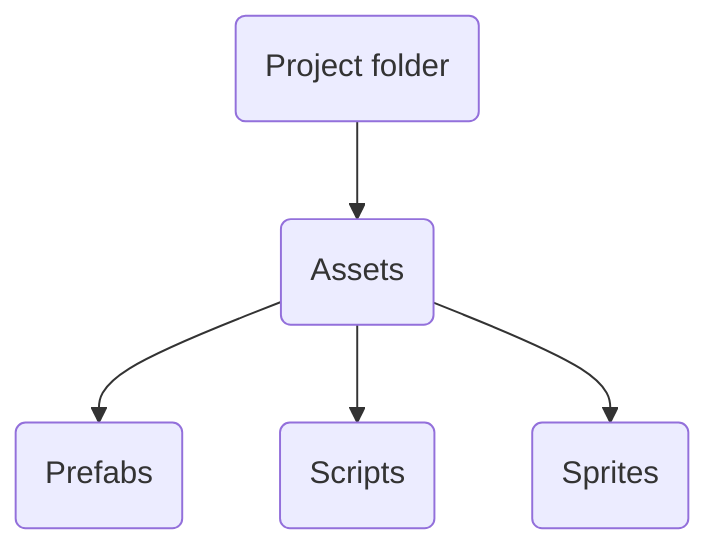

# BomberCircles

BombCircles — это захватывающая игра для двух игроков, вдохновлённая Bomberman. Игрокам предстоит соревноваться на одной арене, используя свои навыки управления персонажем и размещения бомб для уничтожения соперников и разрушения препятствий. Цель игры — победить своего противника.

Игра выполнена в пиксельной графике и поддерживает только локальный многопользовательский режим, позволяя игрокам наслаждаться игровым процессом вместе на одном устройстве. Так, пользователи испытают гораздо больше эмоций, чем при игре вдали друг от друга.

## Управление 

Первый игрок управляет своим персонажем на кнопки WASD и может поставить бомбу на кнопку G.

Второй игрок управляет своим персонажем с помощью стрелочек и может поставить бомбу на кнопку M.

Кроме того, для каждого игрока есть индикатор, который показывает, куда именно он поставит бомбу, если сейчас нажмет на соответствующую кнопку.

## Структура проекта

Структура проекта весьма проста:

В папке *Scripts* содержатся все скрипты игры. В папке *Prefabs* находятся заранее заготовленные игровые объекты. В папке *Sprites* хранятся спрайты и текстуры игры.

Прочие файлы проекта были автоматически сгенерированы Unity при создании проекта, и не редактировались .

## Реализация

В игре всего 4 скрипта. SceneController, PlayerController, BombController, ExplosionController
Ниже приведена документация по этим скриптам:

### SceneController
Это контроллер сцены, по сути игрового процесса. Он отвечает за изменение игрового интерфейса, подсчет побед и перезапуск игры по нажатию на соответствующую кнопку.

| Метод/Поле | Аргументы| Описание  |
|--|--|--|
| bool isGamePaused | - | Переменная, отвечающая за определение, остановлена сейчас игра, или нет. |
| static int player1Wins |-| Поле с количеством побед первого игрока. Статично, для сохранения числа при перезагрузке сцены. |
| static int player2Wins |-| Поле с количеством побед второго игрока. Статично, для сохранения числа при перезагрузке сцены. |
| TextMeshProUGUI player1WinsUIText |-| Ссылка на текстовый UI элемент, в котором отображено количество побед первого игрока. |
| TextMeshProUGUI player2WinsUIText |-| Ссылка на текстовый UI элемент, в котором отображено количество побед второго игрока. |
| static void FinishGame | GameObject playerObjToLose | Данный метод вызывает при завершении раунда игры. В качестве аргумента он принимает игровой объект игрока, которй только что проиграл. В данном методе повышается количество побед у выигравшего игрока, и происходит остановка игры. Метод статичен, чтобы его можно было вызвать без необходимости обращаться к какому-либо конкретному объекту на сцене. |
| static void StartGame | - | Данный метод перезагружает уровень, и снимает игру с паузы. Метод статичен, чтобы его можно было вызвать без необходимости обращаться к какому-либо конкретному объекту на сцене. |
| void Awake | - | Данный метод вызывает при каждой перезагрузке уровня, и в нем обновляется текстовый UI элемент с отображением побед игроков. |
| void Update | - | Данный метод постоянно проверяет не на паузе ли игра, и не нужно ли перезапустить ее. |

### PlayerController
Это контроллер игрока. Данный класс отвечает за управление персонажа и поворот персонажа в сторону движения.

| Метод/Поле | Аргументы| Описание  |
|--|--|--|
| KeyCode inputUp | -| Кнопка, отвечающая за движение вверх |
| KeyCode inputDown | -| Кнопка, отвечающая за движение вниз |
| KeyCode inputLeft | -| Кнопка, отвечающая за движение влево |
| KeyCode inputRight | -| Кнопка, отвечающая за движение вправо |
| float speed | -| Скорость движения персонажа |
| Rigidbody2D rigidbody | - | компонент, подключающий физическое поведение для объекта  |
| Transform playerTransform | - | Позиция и поворот персонажа |
| Vector2 currentMovementDirection | - | "Направление" движения персонажа на данный момент. |
| BombController playerBombController | - | Компонент для управления постановкой бомб |
| void Start | - | Метод, вызываемый перед началом уровня, в котором инициализируются поля rigidbody, playerTransform, playerBombController |
| void Update | - | Метод, вызываемый каждый кадр в игре, в котором считываются нажатые кнопки, определяется текущее направление, и вызывается метод поворота спрайта персонажа в нужную сторону |
| SetSpriteDirection | float xInput,  float yInput | Метод, поворачивающий спрайт персонажа по направлению движения |
| void FixedUpdate | - | Метод, вызываемый каждый небольшой промежуток времени deltatime. Используется для установки скорости движения персонажа |

### BombController	
Это контроллер бомб. Он отвечает за корректное поведение бомб на сцене, создание взрывов.

| Метод/Поле | Аргументы| Описание  |
|--|--|--|
| GameObject bombPrefab | - | Заранее заготовленный объект бомбы, которая и будет устанавливаться игроком |
| ExplosionController explosionPrefab | - | Заранее заготовленный объект взрыва, который будет создаваться при взрыве бомбы |
| int bombFuseTime | - | Время, за которое бомба взрывается |
| int bombNumberLimit | - | Максимальное количество установленных игроком бомб |
| int bombExplosionRadiuis | - | Радиус взрыва бомбы. Точнее, количество клеток по вертикали и горизонтали, относительно установленной бомбы, где произойдет взрыв.  При значении 1 - взрыв происходит только на месте установки бомбы |
| LayerMask explosionLayerMask | - | Слой, на котором происходит игра. Необходим для корректных коллизий взрывов. |
| float bombPulseSpeed | - | Скорость анимации пульсации бомбы |
| float bombPulseAmount | - | Как сильно пульсирует бомба во время анимации |
| List<GameObject> placedBombs | - | Все установленные игроком бомбы |
| GameObject bombIndicatorPrefab | - | Объект индикатора, куда будет поставлена бомба |
| GameObject currentBombIndicatorObj | - | Текущий объект индикатора, который существует на сцене |
| void PlaceBombIndicator() | - | Метод, отвечающий за создание индикатора установки бомбы на сцене |
| void PlaceBomb() | - | Метод установки бомбы |
| IEnumerator Pulse() | GameObject bomb | Метод (корутина) для анимации бомбы |
| void Explode() | GameObject bomb | Метод для взрыва бомбы |
| ExplodeInDirection() | Vector2 startPosition, Vector2 direction, int length | Рекурсивный метод для взрыва в определенном направлении |
| Vector2 getBombPosition() | - | Метод определения координаты для установки бомбы, или ее индикатора |
| IEnumerator InitBomb() | - | Метод (корутина) для создания и инициализации бомбы |

### ExplosionController
Это контроллер объекта взрыва на карте. А нем происходит определение коллизии с контейнером или игроком, и их удаление

| Метод/Поле | Аргументы| Описание  |
|--|--|--|
| float explosionTime | - | Время существования взрыва на карте |
|  Tilemap desctructables | - | Карта тайлов с уничтожаемыми объектами |
| void OnTriggerEnter2D() | Collider2D other | Метод, вызываемый при срабатывании триггера на коллизию с чем-либо. В данном случае, с игроком, что приводит к его поражению |
| void Start() | - | Метод, вызываемый при начале игры |
| void Awake() |  - | Метод, вызываемый при создании объекта |
| void ClearDestructable() | - | Метод, вызываемый для уничтожения контейнера |
| IEnumerator Pulse() | - | Метод (корутина) для анимации |
